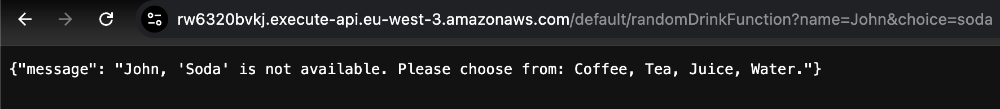

# Random Drink Picker

**Summary:**  
A serverless application that uses AWS Lambda, DynamoDB, and API Gateway to fetch a list of drinks, process user requests, and return personalized responses dynamically.

---

## Key Features
- **Dynamically Fetches Drinks:** Fetches a list of drinks from DynamoDB.
- **Validates User Input:** Checks user-provided drink choices for validity.
- **Random Selection:** Randomly selects a drink if no choice is provided.
- **Serverless Architecture:** Fully serverless with AWS API Gateway as the frontend.
- **Robust Logging:** Logs for monitoring and debugging via AWS CloudWatch.

---

## Architecture Diagram


---

## Technology Stack
- **AWS Lambda:**  Handles the backend logic for processing drink requests.
- **AWS API Gateway:** Serves as the HTTP interface for accessing the Lambda function.
- **AWS DynamoDB:** Stores the list of drinks dynamically.
- **AWS CloudWatch:** Provides logs for monitoring and debugging.

## API call
```bash
curl "https://rw6320bvkj.execute-api.eu-west-3.amazonaws.com/default/randomDrinkFunction?name=John&choice=tea"
```
## API Test Examples
**Valid Drink Choice**


**No Drink Choice**


**Invalid Drink Choice**


**Guest with Invalid Choice**

